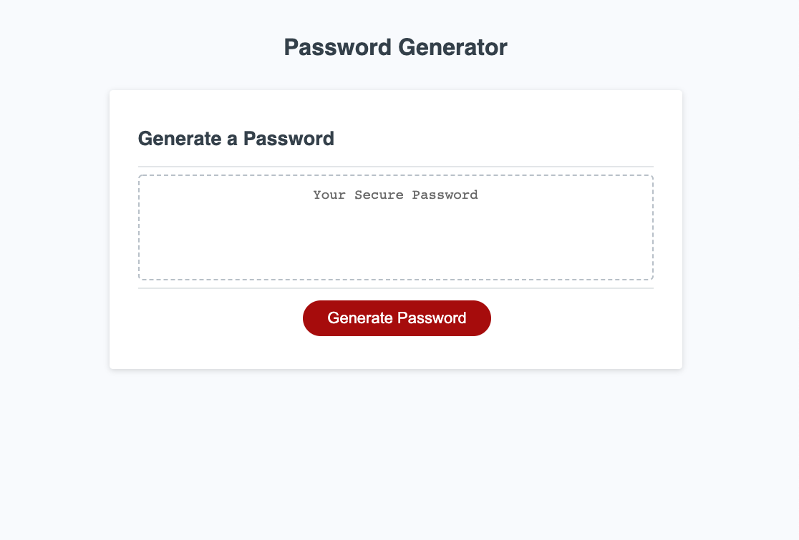
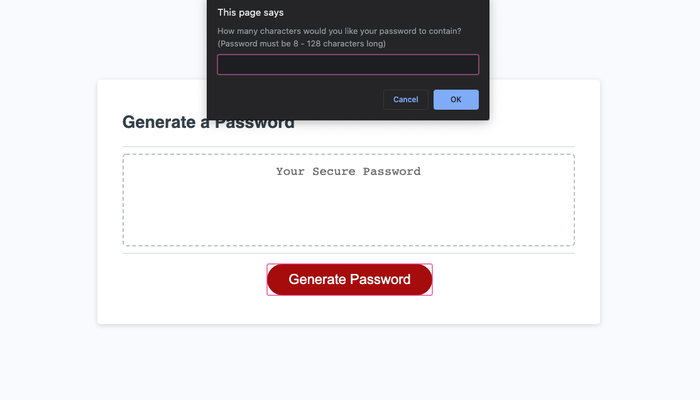
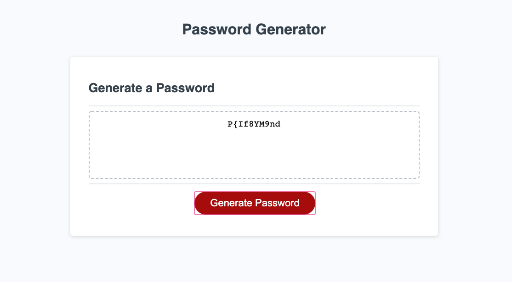
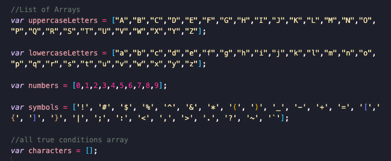
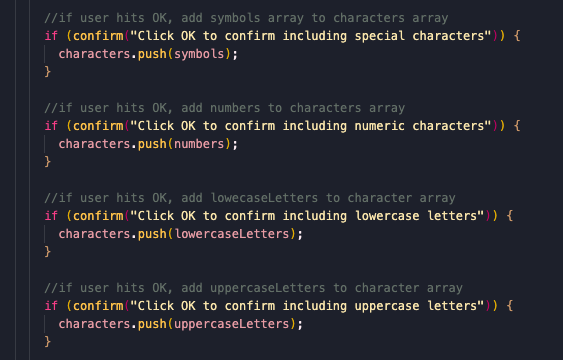
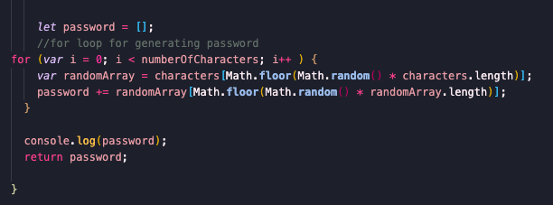

# passwordGenerator

This application was created to generate a strong random password.

Various questions popup on the screen to retrieve what type of characters the user would want in their password.

Finally a random password is generated according to the user's preference.

In order to get this website to function:

* I had to create multiple arrays of different characters and one empty array to push the arrays that the user wanted in their password.

* I used these conditions to push the arrays into the empty array.

* Finally I needed a for loop to first choose a random array (from the conditions the user chose), then from that array, choose a random charcter. This would repeat according to the length of the password the user wanted.

