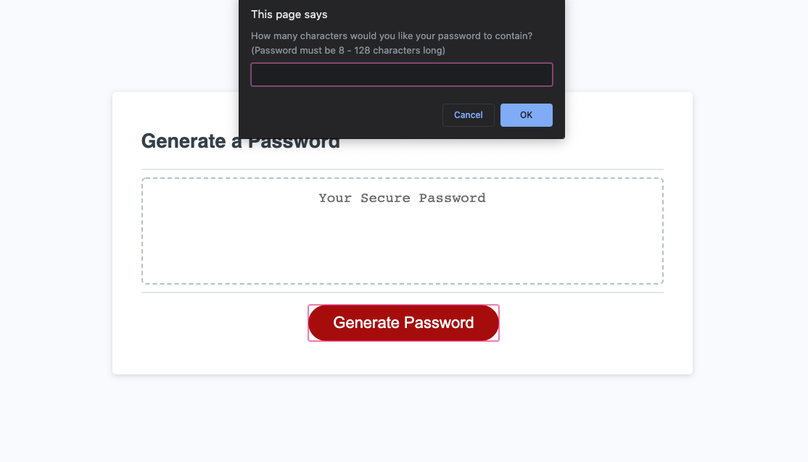
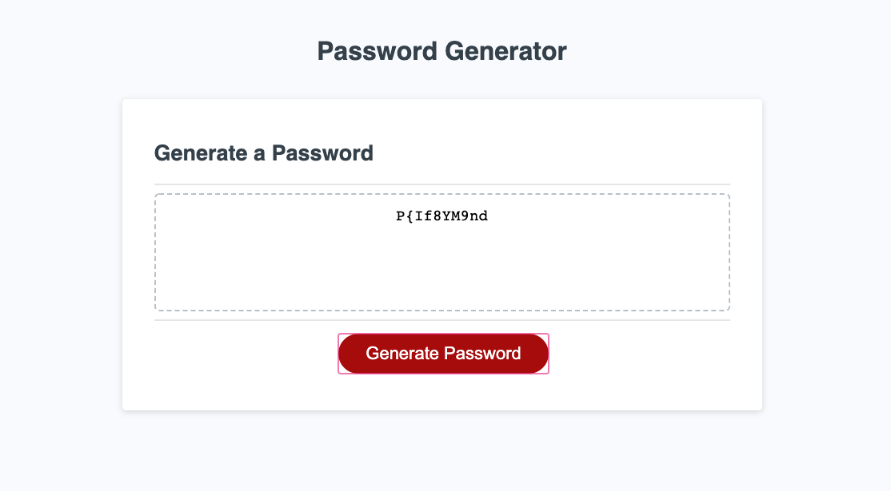
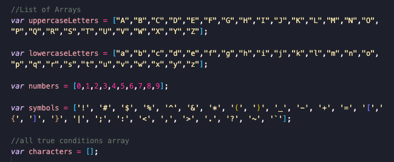
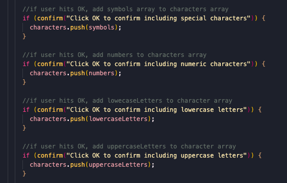
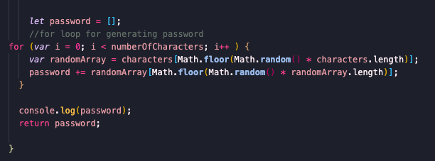

# Password Generator

[View App](https://ashvinit.github.io/passwordGenerator)

## Description

This application allows users to generate a unique password. The user can choose the length of the password and the strength of the password by choosing appropriate answers to prompts and confirmations from the window. 

Various questions popup on the screen to retrieve what type of characters the user would want in their password.

Finally a random password is generated according to the user's preference.

In order to get this website to function:

* I had to create multiple arrays of different characters and one empty array to push the arrays that the user wanted in their password.

* I used these conditions to push the arrays into the empty array.

* Finally I needed a for loop to first choose a random array (from the conditions the user chose), then from that array, choose a random charcter. This would repeat according to the length of the password the user wanted.

## Table of Contents

* [Installation](#installation)
* [Tests](#tests)
* [Questions](#questions)

## Installation

The command that should be run to install dependencies is: 
No dependencies required.

## Tests

Open index.html in the browser.

## Questions

If you have any further questions regarding this project, please feel free to contact.

GitHub Username: ashvinit
Email Address: ashvinithomas@gmail.com

